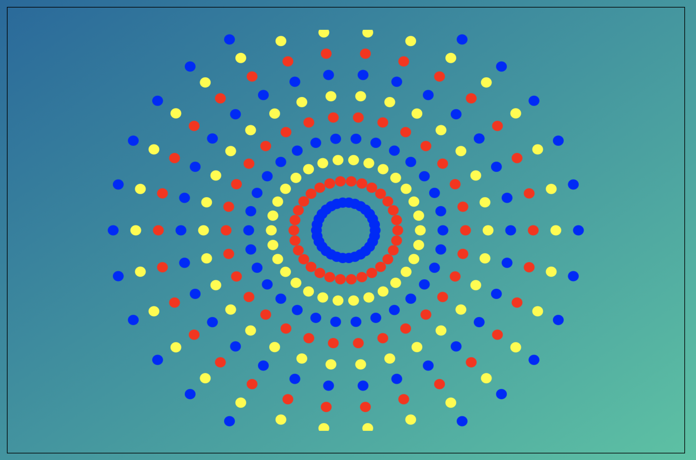

# Bekanta dig med canvas

En `canvas` är ett HTML-objekt som det går att "måla" t ex geometriska figurer på, skriva text eller göra animeringar på. Det styrs från en JavaScript-fil och hela området är koordinatmappat.

JavaScript-filen ovan demonstrerar några grundläggande figurer och hur det går till att layouta en `canvas`. Tanken är att du själv ska pröva på det genom att i första hand göra några förändringar i denna givna JavaScript-fil.

1.  I slutet av filen `script.js` finns några funktionsanrop: en funktion som skapar en kvadrat med text i mitten på sidan, en som ritar en cirkelskiva, en som ritar ett mönster med många små kvadrater med växlande färg och en som ritar punkter på en cirkel (punkterna består i sin tur av små cirklar).

    Se till att det enbart är kvadraten med dess text som syns på sidans `canvas`. Pröva att flytta kvadraten till olika ställen. Speciellt ska du se var origo ligger och vilken del av kvadraten som lägger sig på det givna läget. Pröva också att ändra storlek och färg på kvadraten.

2.  En cirkel ritas som en "fylld sektor", där sektorns vinkel är 360 grader (eller egentligen 2\*pi). Pröva några olika start- och slutvinklar på den fyllda sektorn för att skapa olika figurer.

3.  Funktionen `paintSimpleSquarePattern` ritar ett mönster med lite mindra kvadrater. Experimentera med antalet rader och kolumner och försök att lägga till en tredje färg som ingår i färgväxlingen.

4.  Funktionen `paintRing` ritar punkter som ligger på en cirkel. I originalutförandet så är dessa "punkter" 12 st. cirkelskivor. Pröva att ändra antalet på dessa punkter så att de fortfarande ligger symmetriskt. Pröva också att skapa flera cirklar med olika radie och färg, jag tänker mig något i stil med nedanstående bild.
    

    (Behöver du hjälp? Tjuvkika på [lösningsförslaget](https://gist.github.com/nika-edu/70b5ea2ed898c06b43247039737a0cd8).)

[Här finns även en Canvas-referens med fler metoder](https://www.w3schools.com/tags/ref_canvas.asp)
